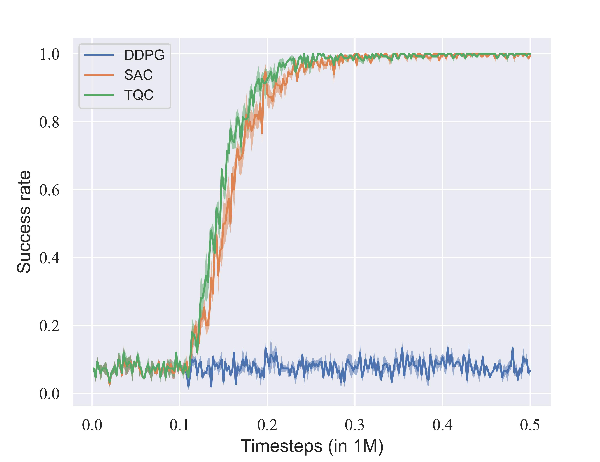

# Open-Source Reinforcement Learning Environments Implemented in MuJoCo with Franka Manipulator

This repository is inspired by [panda-gym](https://github.com/qgallouedec/panda-gym.git) and [Fetch](https://robotics.farama.org/envs/fetch/) environments and is developed with the Franka Emika Panda arm in [MuJoCo Menagerie](https://github.com/google-deepmind/mujoco_menagerie) on the MuJoCo physics engine. Three open-source environments corresponding to three manipulation tasks, `FrankaPush`, `FrankaSlide`, and `FrankaPickAndPlace`, where each task follows the Multi-Goal Reinforcement Learning framework. DDPG, SAC, and TQC with HER are implemented to validate the feasibility of each environment. Benchmark results are obtained with [stable-baselines3](https://github.com/DLR-RM/stable-baselines3) and shown below.

There is still a lot of work to be done on this repo, so please feel free to raise an issue and share your idea!

## Tasks
<div align="center">

`FrankaPushSparse-v0` | `FrankaSlideSparse-v0` | `FrankaPickAndPlaceSparse-v0`
|:------------------------:|:------------------------:|:------------------------:|
 |  | 
</div>

## Benchmark Results

<div align="center">

`FrankaPushSparse-v0` | `FrankaSlideSparse-v0` | `FrankaPickAndPlaceSparse-v0`
|:------------------------:|:------------------------:|:------------------------:|
 |  | 

</div>

## Installation

All essential libraries with corresponding versions are listed in [`requirements.txt`](requirements.txt).

## Test

```python
import sys
import time
import gymnasium as gym
import panda_mujoco_gym

if __name__ == "__main__":
    env = gym.make("FrankaPickAndPlaceSparse-v0", render_mode="human")

    observation, info = env.reset()

    for _ in range(1000):
        action = env.action_space.sample()
        observation, reward, terminated, truncated, info = env.step(action)

        if terminated or truncated:
            observation, info = env.reset()

        time.sleep(0.2)

    env.close()

```

## Citation

If you use this repo in your work, please cite:

```
@misc{xu2023opensource,
      title={Open-Source Reinforcement Learning Environments Implemented in MuJoCo with Franka Manipulator}, 
      author={Zichun Xu and Yuntao Li and Xiaohang Yang and Zhiyuan Zhao and Lei Zhuang and Jingdong Zhao},
      year={2023},
      eprint={2312.13788},
      archivePrefix={arXiv},
      primaryClass={cs.RO}
}
```